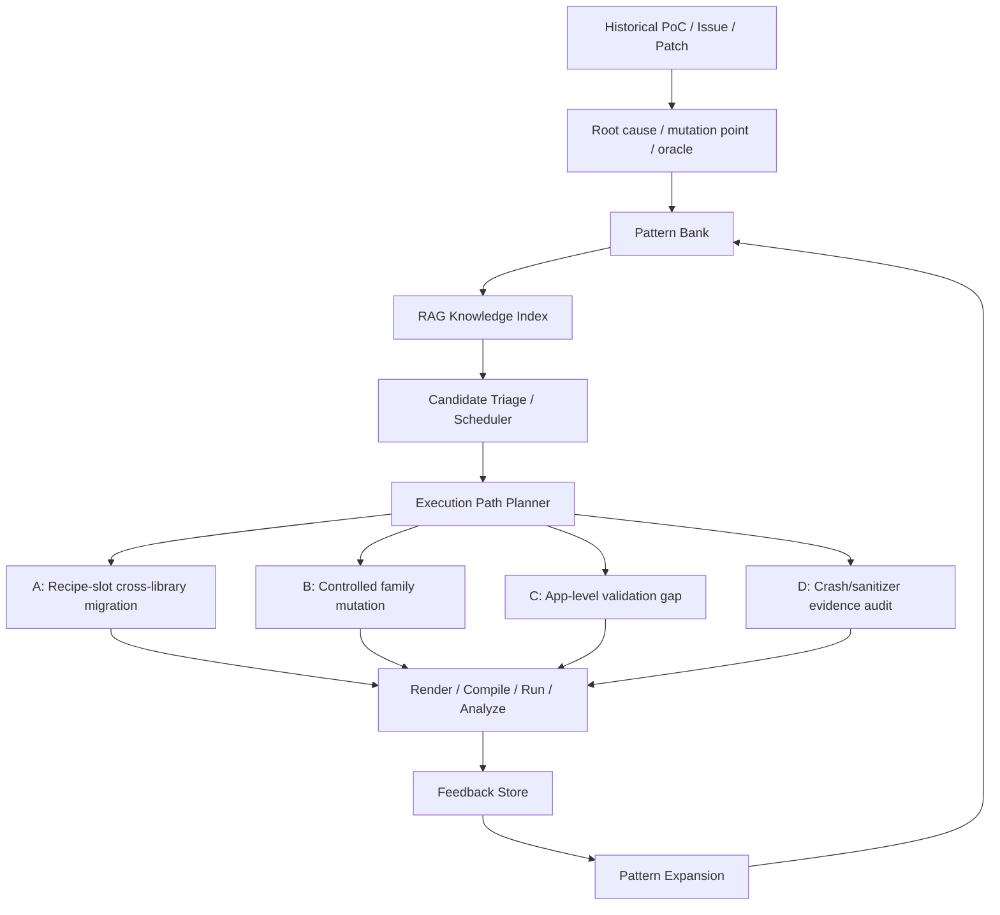

# Current Framework Overview

一句话定义：这个项目现在是一个以 historical PoC / issue / patch 的根因和 oracle 为起点，进行跨库、跨版本、同 family 扩展的新候选发现框架，而不是历史 issue 复现器。

## Inputs

- historical PoC / issue / patch / regression test
- root cause、mutation point、failure signal、oracle
- API constraints、unit-test evidence、raw pattern notes、Wycheproof vectors
- previous run feedback and verdict summaries

## Component Roles

- Pattern Bank: 统一记录 pattern、family、oracle、verdict、feedback、priority 和下一步建议。
- RAG: 把 API constraints、pattern docs、feedback、api cards 等变成可检索证据，用于 candidate mapping 和 adapter context。
- Scheduler: 从 Pattern Bank / feedback 中排序候选，并分发到 A/B/C/D 路径。
- Feedback Store: 把 compile/run/analyze 结果回灌到 pattern bank 和 scheduler，驱动 pattern expansion。

## Execution Paths

- A-path: recipe-slot cross-library migration。需要 mask、selected_mask_units、RAG、GLM slot_bindings、adapter_validate、template render、compile/run/analyze。
- B-path: controlled family mutation sprint。适合已有 family 维度和受控 renderer/analyzer 的同族扩展。
- C-path: app-level validation gap triage。关注 CLI/app 行为，例如 DER trailing malformed tail 的输出、stderr、exit status。
- D-path: crash/sanitizer evidence audit。先确认 crash/sanitizer、版本和 harness 合法性，再决定是否进入 B 或 A。

## LLM / GLM Boundary

LLM/GLM 只应生成 `slot_bindings`。它不能生成 `init_block`、`trigger_block`、`cleanup_block`、`oracle_strategy` 等 free-form C block。

## Mask / Oracle

AST mask 和 `selected_mask_units` 主要服务 A-path 的 source-template traceability 和 mutation-slot 抽取。Oracle 在 pattern bank、adapter recipe、renderer/analyzer 和 runner verdict rules 中定义，并通过 compile/run/analyze 与 migration pair summary 验证。

## Mermaid

## Current Judgment

当前项目仍符合原始目标：historical PoC 模式迁移与新候选发现。关键风险不是链路方向错了，而是某些 sprint 如果停在 seed validation，就会退化成 historical issue reproduction。解决办法是强制接 pattern expansion。
